# 口琴简谱集

收集了一些经典好吹的口琴谱子，【持续更新。。。】

<!--more-->

## 布鲁斯口琴C调第1把位音阶图

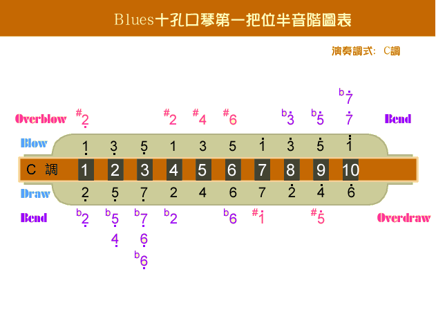

## 送别

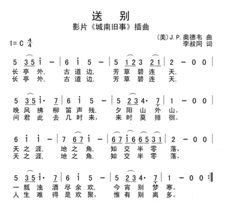

## 爱尔兰画眉

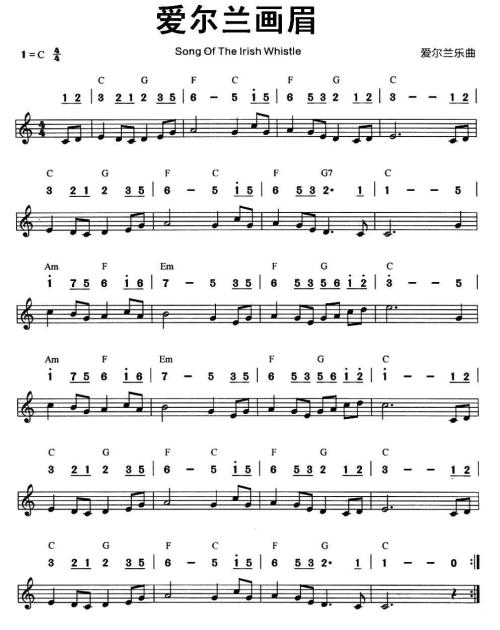

## 天空之城

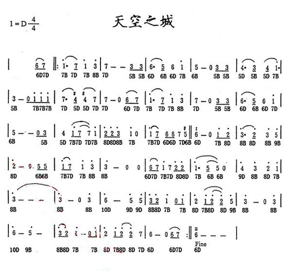

## 星之所在

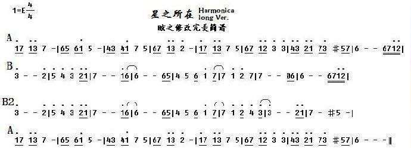

## 追梦人

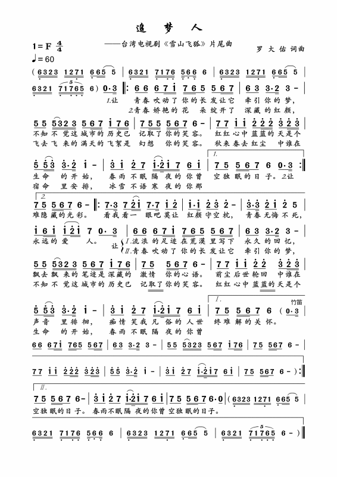

## 平凡之路

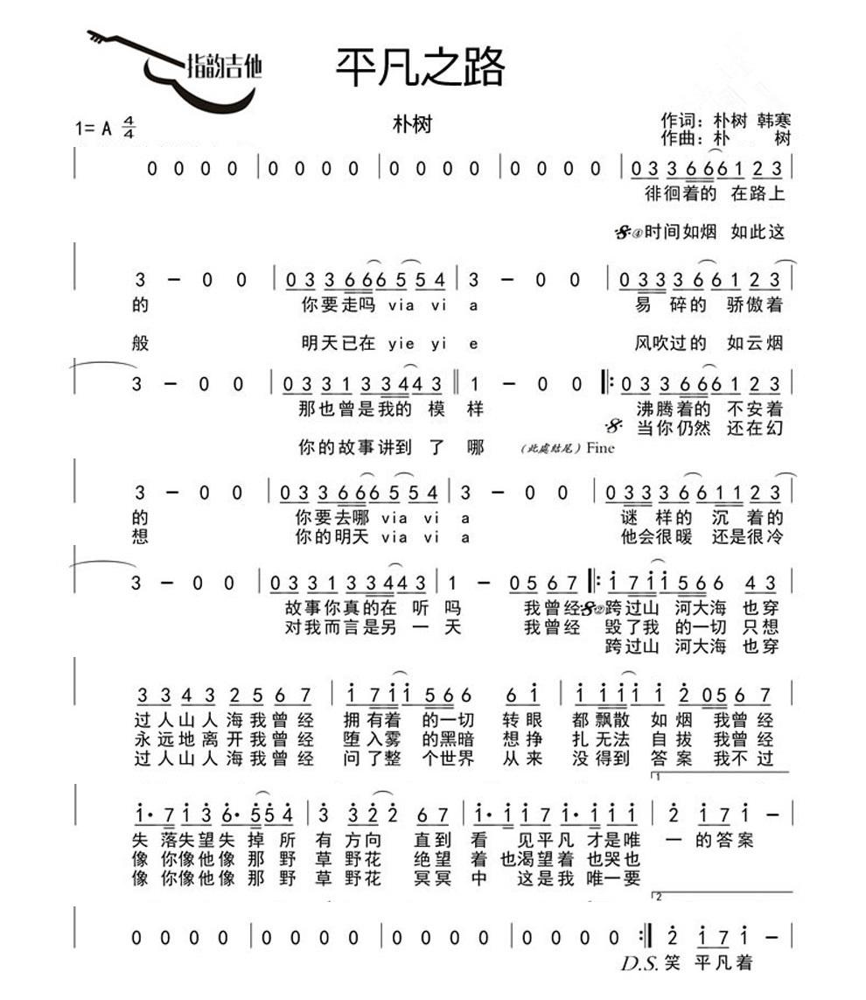

## 喀秋莎

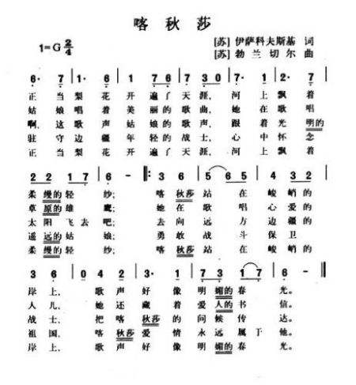

## 三套车

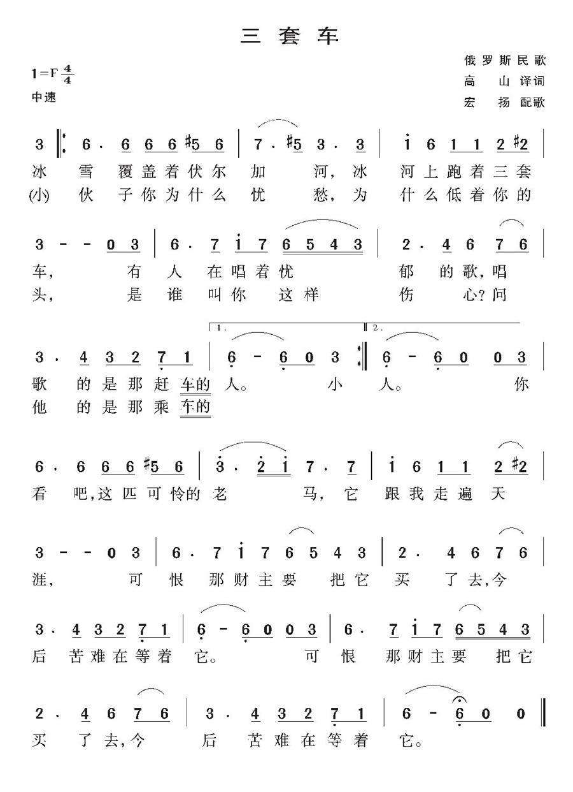

## 啊，朋友再见

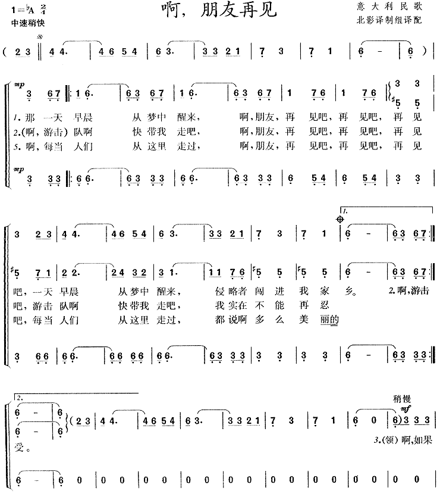

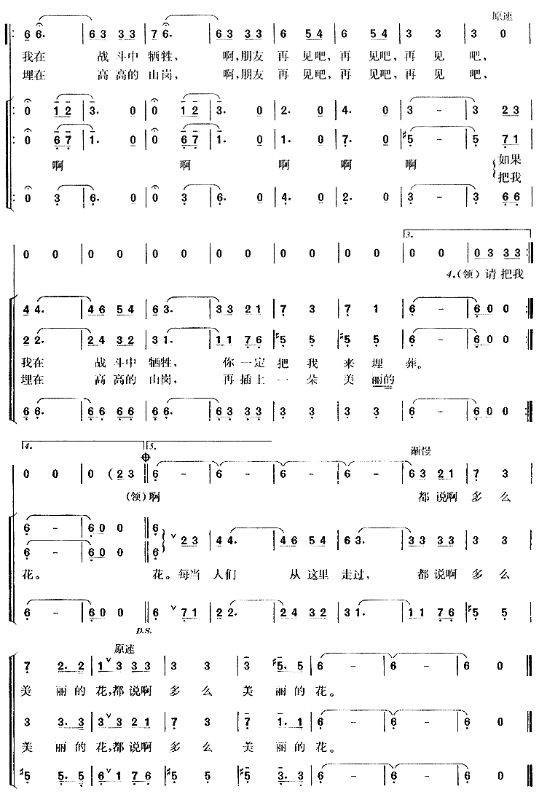

## The girl I left behind me

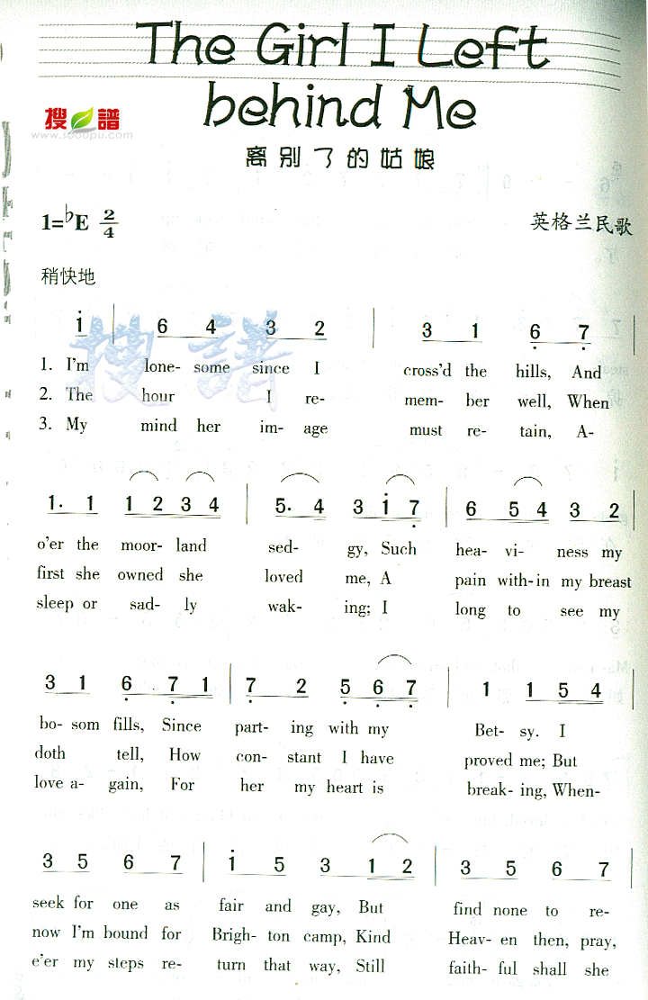

**[演奏视频地址](https://tv.sohu.com/v/dXMvMTQzNzU1NTY4LzYzODIxMzQ5LnNodG1s.html)**

