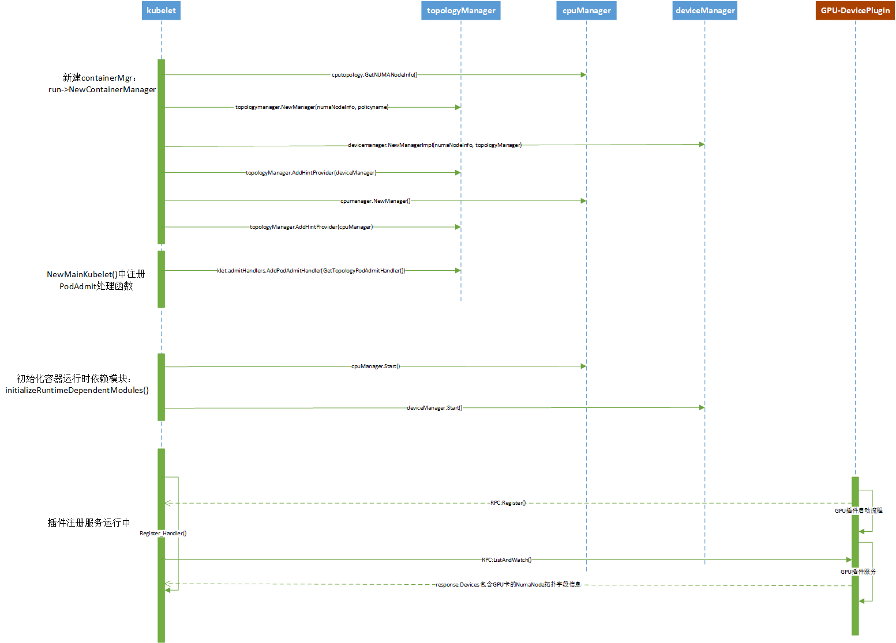
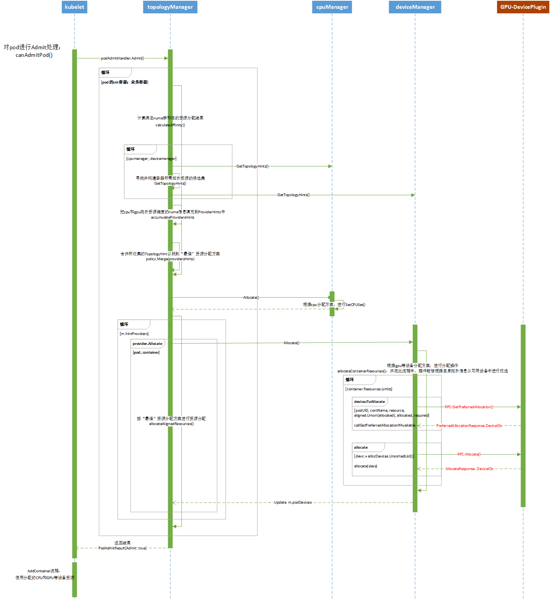

# K8S affinity topology feature源码分析


topology manager是k8s1.16版本以后kubelet中新增的子模块，并在1.18版本更新为beta版本，按节点本地资源按NUMA亲和性和插件自身拓扑亲和性策略，对作业和任务进行资源分配。本文k8s源码分析为1.20版本。

<!--more-->

## topology-manager设计方案

kubelet numa拓扑亲和性资源分配方案：

[Kubernetes Topology Manager Moves to Beta - Align Up!](https://kubernetes.io/blog/2020/04/01/kubernetes-1-18-feature-topoloy-manager-beta/)


## 流程

在分析源码前，先整理画出相关流程时序图。便于总体理解业务流程。如下

### 资源管理组件创建和device plugin注册流程

这里以nvidia-k8s-deviceplugin为例，说明GPU设备注册流程



### kubelet分配资源流程

kubelet根据topology manager计算资源拓扑亲和性，并由cpu manager分配cpu资源；device manager分配插件资源



### 主流程代码

kubelet/cm/topologymanager/scope_container.go


```go
func (s *containerScope) Admit(pod *v1.Pod) lifecycle.PodAdmitResult {
    if s.policy.Name() == PolicyNone {
        return s.admitPolicyNone(pod)
    }

    for _, container := range append(pod.Spec.InitContainers, pod.Spec.Containers...) {
        // bestHint, admit := s.calculateAffinity(pod, &container)
        providersHints := s.accumulateProvidersHints(pod, container)
        bestHint, admit := s.policy.Merge(providersHints)

        if !admit {
            return topologyAffinityError()
        }

        if (s.podTopologyHints)[string(pod.UID)] == nil {
            (s.podTopologyHints)[string(pod.UID)] = make(map[string]TopologyHint)
        }

        klog.Infof("[topologymanager] Topology Affinity for (pod: %v container: %v): %v", format.Pod(pod), container.Name, bestHint)
        (s.podTopologyHints)[string(pod.UID)][container.Name] = bestHint
        err := s.allocateAlignedResources(pod, &container)
        if err != nil {
            return unexpectedAdmissionError(err)
        }
    }
    return admitPod()
}
```


1. 遍历pod中的所有容器
2. 计算ProvidersHints，获取分配方案建议bestHint, 结果admit
3. 按上面的对齐分配方案，为pod分配资源

参考数据结构

```go
// Scope interface for Topology Manager
type Scope interface {
    Name() string
    Admit(pod *v1.Pod) lifecycle.PodAdmitResult
    // AddHintProvider adds a hint provider to manager to indicate the hint provider
    // wants to be consoluted with when making topology hints
    AddHintProvider(h HintProvider)
    // AddContainer adds pod to Manager for tracking
    AddContainer(pod *v1.Pod, containerID string) error
    // RemoveContainer removes pod from Manager tracking
    RemoveContainer(containerID string) error
    // Store is the interface for storing pod topology hints
    Store
}

type scope struct {
    mutex sync.Mutex
    name  string
    // Mapping of a Pods mapping of Containers and their TopologyHints
    // Indexed by PodUID to ContainerName
    podTopologyHints podTopologyHints
    // The list of components registered with the Manager
    hintProviders []HintProvider
    // Topology Manager Policy
    policy Policy
    // Mapping of PodUID to ContainerID for Adding/Removing Pods from PodTopologyHints mapping
    podMap map[string]string
}
// 格式: map[string(pod.UID)][container.Name]TopologyHint
type podTopologyHints map[string]map[string]TopologyHint

// TopologyHint is a struct containing the NUMANodeAffinity for a Container
type TopologyHint struct {
    NUMANodeAffinity bitmask.BitMask
    // Preferred is set to true when the NUMANodeAffinity encodes a preferred
    // allocation for the Container. It is set to false otherwise.
    Preferred bool
}

// HintProvider is an interface for components that want to collaborate to
// achieve globally optimal concrete resource alignment with respect to
// NUMA locality.
type HintProvider interface {
    // GetTopologyHints returns a map of resource names to a list of possible
    // concrete resource allocations in terms of NUMA locality hints. Each hint
    // is optionally marked "preferred" and indicates the set of NUMA nodes
    // involved in the hypothetical allocation. The topology manager calls
    // this function for each hint provider, and merges the hints to produce
    // a consensus "best" hint. The hint providers may subsequently query the
    // topology manager to influence actual resource assignment.
    GetTopologyHints(pod *v1.Pod, container *v1.Container) map[string][]TopologyHint
    // GetPodTopologyHints returns a map of resource names to a list of possible
    // concrete resource allocations per Pod in terms of NUMA locality hints.
    GetPodTopologyHints(pod *v1.Pod) map[string][]TopologyHint
    // Allocate triggers resource allocation to occur on the HintProvider after
    // all hints have been gathered and the aggregated Hint is available via a
    // call to Store.GetAffinity().
    Allocate(pod *v1.Pod, container *v1.Container) error
}

```

## topology affinity

hintProviders实际上为参与进行资源分配的资源管理器，其扩展topo计算接口，目前使用的是cpumanger和devicemanager
- cpumanger用于管理分配cpu资源，比如按static策略分配cpuset
- devicemanager用于管理分配k8s可扩展资源，比如k8s-nvidia-gpu插件管理的gpu资源

```go
func (s *containerScope) accumulateProvidersHints(pod *v1.Pod, container *v1.Container) []map[string][]TopologyHint {
    var providersHints []map[string][]TopologyHint

    // hintProviders实际上为参与进行资源分配的资源管理器，其扩展topo计算接口，目前使用的是cpumanger和devicemanager
    for _, provider := range s.hintProviders {
        // Get the TopologyHints for a Container from a provider.
        hints := provider.GetTopologyHints(pod, container)
        providersHints = append(providersHints, hints)
        klog.Infof("[topologymanager] TopologyHints for pod '%v', container '%v': %v", format.Pod(pod), container.Name, hints)
    }
    return providersHints
}
```


## cpumanager

cpumanager ：GetTopologyHints -> m.policy.GetTopologyHints(m.state, pod, container)[staticPolicy.GetTopologyHints] -> generateCPUTopologyHints(available, reusable, requested)

1. 计算并返回cpu资源的TopologyHint列表信息
```go

func (p *staticPolicy) GetTopologyHints(){

    // Get a list of available CPUs.
    available := p.assignableCPUs(s)

    // Get a list of reusable CPUs (e.g. CPUs reused from initContainers).
    // It should be an empty CPUSet for a newly created pod.
    reusable := p.cpusToReuse[string(pod.UID)]

    // Generate hints.
    cpuHints := p.generateCPUTopologyHints(available, reusable, requested)
    // 返回cpu资源的TopologyHint列表信息
    return map[string][]topologymanager.TopologyHint{
        // "cpu" : [{01 true} {10 true} {11 false}]
        string(v1.ResourceCPU): cpuHints,
    }
}
```


2. 计算cpu Hints generateCPUTopologyHints

```go
func (p *staticPolicy) generateCPUTopologyHints(availableCPUs cpuset.CPUSet, reusableCPUs cpuset.CPUSet, request int) []topologymanager.TopologyHint {

    // Initialize minAffinitySize to include all NUMA Nodes.
    minAffinitySize := p.topology.CPUDetails.NUMANodes().Size()
    // 执行了具体计算topo hint的算法
    bitmask.IterateBitMasks(topology.CPUDetails.NUMANodes().ToSlice(), call_back_func{})

// If they don't, then move onto the next combination.
        if numMatching < request {
            return
        }

    // Loop back through all hints and update the 'Preferred' field based on
    // counting the number of bits sets in the affinity mask and comparing it
    // to the minAffinitySize. Only those with an equal number of bits set (and
    // with a minimal set of numa nodes) will be considered preferred.
    for i := range hints {
        // 选择bitmap最窄的NUMANode，Preferred = true
        if hints[i].NUMANodeAffinity.Count() == minAffinitySize {
            hints[i].Preferred = true
        }
    }
    // 返回hints结果集，形式如：[{01 true} {10 true} {11 false}]
    // Preferred 优选字段标识 该hint是否为优先考虑方案
    return hints

}
```


## devicemanager

1. GetTopologyHints

```go
// GetTopologyHints implements the TopologyManager HintProvider Interface which
// ensures the Device Manager is consulted when Topology Aware Hints for each
// container are created.
func (m *ManagerImpl) GetTopologyHints(pod *v1.Pod, container *v1.Container) map[string][]topologymanager.TopologyHint {
    // Garbage collect any stranded device resources before providing TopologyHints
    m.UpdateAllocatedDevices()

    // Loop through all device resources and generate TopologyHints for them..
    deviceHints := make(map[string][]topologymanager.TopologyHint)
    for resourceObj, requestedObj := range container.Resources.Limits {
        resource := string(resourceObj)
        requested := int(requestedObj.Value())

        // Only consider resources associated with a device plugin.
        // 只考虑device plugin的扩展资源
        if m.isDevicePluginResource(resource) {
            // Only consider devices that actually container topology information.
            // 只考虑有拓扑信息的资源，比如按numa对齐的gpus
            if aligned := m.deviceHasTopologyAlignment(resource)!aligned {
                klog.Infof("[devicemanager] Resource '%v' does not have a topology preference", resource)
                deviceHints[resource] = nil
                continue
            }

            // Get the list of available devices, for which TopologyHints should be generated.
            available := m.getAvailableDevices(resource)
            reusable := m.devicesToReuse[string(pod.UID)][resource]

            // Generate TopologyHints for this resource given the current
            // request size and the list of available devices.
            deviceHints[resource] = m.generateDeviceTopologyHints(resource, available, reusable, requested)
        }
    }

    return deviceHints
}
```

2. 计算device Hints generateDeviceTopologyHints

```go

func (m *ManagerImpl) generateDeviceTopologyHints(resource string, available sets.String, reusable sets.String, request int) []topologymanager.TopologyHint {
    // Initialize minAffinitySize to include all NUMA Nodes
    minAffinitySize := len(m.numaNodes)

    // Iterate through all combinations of NUMA Nodes and build hints from them.
    hints := []topologymanager.TopologyHint{}
    bitmask.IterateBitMasks(m.numaNodes, call_back_func{})

    // Loop back through all hints and update the 'Preferred' field based on
    // counting the number of bits sets in the affinity mask and comparing it
    // to the minAffinity. Only those with an equal number of bits set will be
    // considered preferred.
    for i := range hints {
        if hints[i].NUMANodeAffinity.Count() == minAffinitySize {
            hints[i].Preferred = true
        }
    }

    return hints
}

```


## merge hints

### merge算法思想

**merge思想，是把多中类型资源的topo hints（即下面中的每一行），合并为一个hint，合并算法为位与运算。**


```shell

cross-product entry
{cpu, gpu-vendor.com/gpu, nic-vendor.com/nic}   "merged" hint
{{01: True}, {01: True}, {01: True}}            {01: True}
{{01: True}, {01: True}, {10: True}}            {00: False}
{{01: True}, {10: True}, {01: True}}            {00: False}
{{01: True}, {10: True}, {10: True}}            {00: False}
{{10: True}, {01: True}, {01: True}}            {00: False}
{{10: True}, {01: True}, {10: True}}            {00: False}
{{10: True}, {10: True}, {01: True}}            {00: False}
{{10: True}, {10: True}, {10: True}}            {10: True}
{{11: False}, {01: True}, {01: True}}           {01: False}
{{11: False}, {01: True}, {10: True}}           {00: False}
{{11: False}, {10: True}, {01: True}}           {00: False}
{{11: False}, {10: True}, {10: True}}           {10: False}

```

不同的topo policy实现，区别就在merge处理中，如下

```go

func (p *nonePolicy) Merge(providersHints []map[string][]TopologyHint) (TopologyHint, bool) {
    return TopologyHint{}, p.canAdmitPodResult(nil)
}

func (p *bestEffortPolicy) Merge(providersHints []map[string][]TopologyHint) (TopologyHint, bool) {
    // 1. 遍历全部hint providers，收集全部的hint，到filteredProvidersHints列表中。
    // 本质上，是把map数据，转换成二维列表[][]TopologyHint，目的便于后面的mergeFilteredHints处理
    filteredProvidersHints := filterProvidersHints(providersHints)
    bestHint := mergeFilteredHints(p.numaNodes, filteredProvidersHints)
    admit := p.canAdmitPodResult(&bestHint)
    return bestHint, admit
}

func (p *restrictedPolicy) Merge(providersHints []map[string][]TopologyHint) (TopologyHint, bool) {
    filteredHints := filterProvidersHints(providersHints)
    hint := mergeFilteredHints(p.numaNodes, filteredHints)
    admit := p.canAdmitPodResult(&hint)
    return hint, admit
}

func (p *singleNumaNodePolicy) Merge(providersHints []map[string][]TopologyHint) (TopologyHint, bool) {
    filteredHints := filterProvidersHints(providersHints)
    // Filter to only include don't cares and hints with a single NUMA node.
    singleNumaHints := filterSingleNumaHints(filteredHints)
    bestHint := mergeFilteredHints(p.numaNodes, singleNumaHints)

    defaultAffinity, _ := bitmask.NewBitMask(p.numaNodes...)
    if bestHint.NUMANodeAffinity.IsEqual(defaultAffinity) {
        bestHint = TopologyHint{nil, bestHint.Preferred}
    }

    admit := p.canAdmitPodResult(&bestHint)
    return bestHint, admit
}

```


### mergeFilteredHints处理

```go
func mergeFilteredHints(numaNodes []int, filteredHints [][]TopologyHint) TopologyHint {
    // Set the default affinity as an any-numa affinity containing the list
    // of NUMA Nodes available on this machine.
    defaultAffinity, _ := bitmask.NewBitMask(numaNodes...)

    // Set the bestHint to return from this function as {nil false}.
    // This will only be returned if no better hint can be found when
    // merging hints from each hint provider.
    bestHint := TopologyHint{defaultAffinity, false}
    // 计算merge结果
    iterateAllProviderTopologyHints(filteredHints, call_back_func{})

    return bestHint
}

```

### mergePermutation处理
- 应用了向量叉积(Cross Product)，但只是组合排列，并未求和
- permutation为iterateAllProviderTopologyHints中罗列出的各种资源类型的hints的全部排列
- 位与运算bitmask.And，计算besthint值mergedAffinity
- hint.Preferred 逻辑与关系，全部为true，则为true。否则为false

```go

// Merge a TopologyHints permutation to a single hint by performing a bitwise-AND
// of their affinity masks. The hint shall be preferred if all hits in the permutation
// are preferred.
func mergePermutation(numaNodes []int, permutation []TopologyHint) TopologyHint {
    // Get the NUMANodeAffinity from each hint in the permutation and see if any
    // of them encode unpreferred allocations.
    preferred := true
    defaultAffinity, _ := bitmask.NewBitMask(numaNodes...)
    var numaAffinities []bitmask.BitMask
    for _, hint := range permutation {
        // Only consider hints that have an actual NUMANodeAffinity set.
        if hint.NUMANodeAffinity == nil {
            numaAffinities = append(numaAffinities, defaultAffinity)
        } else {
            numaAffinities = append(numaAffinities, hint.NUMANodeAffinity)
        }

        if !hint.Preferred {
            preferred = false
        }
    }

    // Merge the affinities using a bitwise-and operation.
    mergedAffinity := bitmask.And(defaultAffinity, numaAffinities...)
    // Build a mergedHint from the merged affinity mask, indicating if an
    // preferred allocation was used to generate the affinity mask or not.
    return TopologyHint{mergedAffinity, preferred}
}
```


## bestHint

kubelet会再次遍历merged hint，得出bestHint，最终按bestHint进行资源分配。

bestHint算法思想：

- 优选preference为true的merge hint，即mergedHint.Preferred: true
- 在相同preference条件下，优选长度最窄的NUMANodeAffinity（bitmap类型）

计算好bestHint后，并保存，为后面流程使用

```go
(s.podTopologyHints)[string(pod.UID)][container.Name] = bestHint
```

小结：

**hints的合并流程：resource topo hints -> merged hints -> bestHint**


## 算法函数

### 计算BitMasks 组合

资源单元的分配是种组合算法
bits列表中中每一元素index为资源（如cpu id 等），值为nodeid
```go

// IterateBitMasks iterates all possible masks from a list of bits,
// issuing a callback on each mask.
func IterateBitMasks(bits []int, callback func(BitMask)) {
    var iterate func(bits, accum []int, size int)
    iterate = func(bits, accum []int, size int) {
        if len(accum) == size {
            mask, _ := NewBitMask(accum...)
            callback(mask)
            return
        }
        // 组合，比如size=2时，输出01,10，11
        for i := range bits {
            iterate(bits[i+1:], append(accum, bits[i]), size)
        }
    }
    // bits长度范围内的所有组合 如： 0,1, 01, 10，11等
    for i := 1; i <= len(bits); i++ {
        iterate(bits, []int{}, i)
    }
}

```

- IterateBitMasks是计算topo hint的关键函数，在cpumangager和devicemanager中都有使用

- IterateBitMasks本质上是计算出了资源列表（bits选择列表）的全部组合（size大小），如：cpuset的各种组合；devices中gpus的各种组合

- 算法采用DFS


### 计算AllProviderTopologyHints 排列

不同资源类型的hits合并，是全排列算法
```go
// Iterate over all permutations of hints in 'allProviderHints [][]TopologyHint'.
//
// This procedure is implemented as a recursive function over the set of hints
// in 'allproviderHints[i]'. It applies the function 'callback' to each
// permutation as it is found. It is the equivalent of:
//
// for i := 0; i < len(providerHints[0]); i++
//     for j := 0; j < len(providerHints[1]); j++
//         for k := 0; k < len(providerHints[2]); k++
//             ...
//             for z := 0; z < len(providerHints[-1]); z++
//                 permutation := []TopologyHint{
//                     providerHints[0][i],
//                     providerHints[1][j],
//                     providerHints[2][k],
//                     ...
//                     providerHints[-1][z]
//                 }
//                 callback(permutation)
func iterateAllProviderTopologyHints(allProviderHints [][]TopologyHint, callback func([]TopologyHint)) {
    // Internal helper function to accumulate the permutation before calling the callback.
    var iterate func(i int, accum []TopologyHint)
    iterate = func(i int, accum []TopologyHint) {
        // Base case: we have looped through all providers and have a full permutation.
        if i == len(allProviderHints) {
            callback(accum)
            return
        }

        // Loop through all hints for provider 'i', and recurse to build the
        // the permutation of this hint with all hints from providers 'i++'.
        for j := range allProviderHints[i] {
            iterate(i+1, append(accum, allProviderHints[i][j]))
        }
    }
    iterate(0, []TopologyHint{})
}
```


## 资源分配

### allocateAlignedResources
```go
// It would be better to implement this function in topologymanager instead of scope
// but topologymanager do not track providers anymore
func (s *scope) allocateAlignedResources(pod *v1.Pod, container *v1.Container) error {
    for _, provider := range s.hintProviders {
        err := provider.Allocate(pod, container)
        if err != nil {
            return err
        }
    }
    return nil
}
```

### cpumanger

根据前面计算出的topo hint 进行cpu分配
```go

func (p *staticPolicy) Allocate(s state.State, pod *v1.Pod, container *v1.Container) error {
    if numCPUs := p.guaranteedCPUs(pod, container); numCPUs != 0 {
        

        // Call Topology Manager to get the aligned socket affinity across all hint providers.
        hint := p.affinity.GetAffinity(string(pod.UID), container.Name)
        
        // Allocate CPUs according to the NUMA affinity contained in the hint.
        cpuset, err := p.allocateCPUs(s, numCPUs, hint.NUMANodeAffinity, p.cpusToReuse[string(pod.UID)])

        s.SetCPUSet(string(pod.UID), container.Name, cpuset)
        p.updateCPUsToReuse(pod, container, cpuset)

    }
    // container belongs in the shared pool (nothing to do; use default cpuset)
    return nil
}

```


### devicemanger

devicemanger的资源分配逻辑处理要多一下。首先看下调用链，如下：

Allocate -> allocateContainerResources -> devicesToAllocate

```go
// Returns list of device Ids we need to allocate with Allocate rpc call.
// Returns empty list in case we don't need to issue the Allocate rpc call.
func (m *ManagerImpl) devicesToAllocate(podUID, contName, resource string, required int, reusableDevices sets.String) (sets.String, error) {
    

    // Declare the list of allocated devices.
    // This will be populated and returned below.
    allocated := sets.NewString()

    // Create a closure to help with device allocation
    // Returns 'true' once no more devices need to be allocated.
    allocateRemainingFrom := func(devices sets.String) bool {
        for device := range devices.Difference(allocated) {
            m.allocatedDevices[resource].Insert(device)
            allocated.Insert(device)
            needed--
            if needed == 0 {
                return true
            }
        }
        return false
    }

    // Allocates from reusableDevices list first.
    if allocateRemainingFrom(reusableDevices) {
        return allocated, nil
    }

    // Needs to allocate additional devices.
    if m.allocatedDevices[resource] == nil {
        m.allocatedDevices[resource] = sets.NewString()
    }

    // Gets Devices in use.
    devicesInUse := m.allocatedDevices[resource]
    // Gets Available devices.
    available := m.healthyDevices[resource].Difference(devicesInUse)
    if available.Len() < needed {
        return nil, fmt.Errorf("requested number of devices unavailable for %s. Requested: %d, Available: %d", resource, needed, available.Len())
    }

    // Filters available Devices based on NUMA affinity.
    aligned, unaligned, noAffinity := m.filterByAffinity(podUID, contName, resource, available)

    // If we can allocate all remaining devices from the set of aligned ones, then
    // give the plugin the chance to influence which ones to allocate from that set.
    if needed < aligned.Len() {
        // First allocate from the preferred devices list (if available).
        preferred, err := m.callGetPreferredAllocationIfAvailable(podUID, contName, resource, aligned.Union(allocated), allocated, required)
        if err != nil {
            return nil, err
        }
        if allocateRemainingFrom(preferred.Intersection(aligned)) {
            return allocated, nil
        }
        // Then fallback to allocate from the aligned set if no preferred list
        // is returned (or not enough devices are returned in that list).
        if allocateRemainingFrom(aligned) {
            return allocated, nil
        }

        return nil, fmt.Errorf("unexpectedly allocated less resources than required. Requested: %d, Got: %d", required, required-needed)
    }

    // If we can't allocate all remaining devices from the set of aligned ones,
    // then start by first allocating all of the  aligned devices (to ensure
    // that the alignment guaranteed by the TopologyManager is honored).
    if allocateRemainingFrom(aligned) {
        return allocated, nil
    }

    // Then give the plugin the chance to influence the decision on any
    // remaining devices to allocate.
    preferred, err := m.callGetPreferredAllocationIfAvailable(podUID, contName, resource, available.Union(allocated), allocated, required)
    if err != nil {
        return nil, err
    }
    if allocateRemainingFrom(preferred.Intersection(available)) {
        return allocated, nil
    }

    // Finally, if the plugin did not return a preferred allocation (or didn't
    // return a large enough one), then fall back to allocating the remaining
    // devices from the 'unaligned' and 'noAffinity' sets.
    if allocateRemainingFrom(unaligned) {
        return allocated, nil
    }
    if allocateRemainingFrom(noAffinity) {
        return allocated, nil
    }

    return nil, fmt.Errorf("unexpectedly allocated less resources than required. Requested: %d, Got: %d", required, required-needed)
}
```


numa亲和性分配主要在filterByAffinity中

- 构造了perNodeDevices map对象: map[numaid]deivces
- 构造返回结果集：sets.NewString(fromAffinity...), sets.NewString(notFromAffinity...), sets.NewString(withoutTopology...), 即 基于numa亲和性从available资源中过滤出：aligned, unaligned, noAffinity

```go

func (m *ManagerImpl) filterByAffinity(podUID, contName, resource string, available sets.String) (sets.String, sets.String, sets.String) {

    // Build a map of NUMA Nodes to the devices associated with them. A
    // device may be associated to multiple NUMA nodes at the same time. If an
    // available device does not have any NUMA Nodes associated with it, add it
    // to a list of NUMA Nodes for the fake NUMANode -1.
    perNodeDevices := make(map[int]sets.String)
    nodeWithoutTopology := -1
    for d := range available {
        if m.allDevices[resource][d].Topology == nil || len(m.allDevices[resource][d].Topology.Nodes) == 0 {
            if _, ok := perNodeDevices[nodeWithoutTopology]; !ok {
                perNodeDevices[nodeWithoutTopology] = sets.NewString()
            }
            perNodeDevices[nodeWithoutTopology].Insert(d)
            continue
        }

        for _, node := range m.allDevices[resource][d].Topology.Nodes {
            if _, ok := perNodeDevices[int(node.ID)]; !ok {
                perNodeDevices[int(node.ID)] = sets.NewString()
            }
            perNodeDevices[int(node.ID)].Insert(d)
        }
    }

    // Get a flat list of all of the nodes associated with available devices.
    var nodes []int
    for node := range perNodeDevices {
        nodes = append(nodes, node)
    }

    // Sort the list of nodes by how many devices they contain.
    sort.Slice(nodes, func(i, j int) bool {
        return perNodeDevices[i].Len() < perNodeDevices[j].Len()
    })

    // Generate three sorted lists of devices. Devices in the first list come
    // from valid NUMA Nodes contained in the affinity mask. Devices in the
    // second list come from valid NUMA Nodes not in the affinity mask. Devices
    // in the third list come from devices with no NUMA Node association (i.e.
    // those mapped to the fake NUMA Node -1). Because we loop through the
    // sorted list of NUMA nodes in order, within each list, devices are sorted
    // by their connection to NUMA Nodes with more devices on them.
    var fromAffinity []string
    var notFromAffinity []string
    var withoutTopology []string
    for d := range available {
        // Since the same device may be associated with multiple NUMA Nodes. We
        // need to be careful not to add each device to multiple lists. The
        // logic below ensures this by breaking after the first NUMA node that
        // has the device is encountered.
        for _, n := range nodes {
            if perNodeDevices[n].Has(d) {
                if n == nodeWithoutTopology {
                    withoutTopology = append(withoutTopology, d)
                } else if hint.NUMANodeAffinity.IsSet(n) {
                    fromAffinity = append(fromAffinity, d)
                } else {
                    notFromAffinity = append(notFromAffinity, d)
                }
                break
            }
        }
    }

    // Return all three lists containing the full set of devices across them.
    return sets.NewString(fromAffinity...), sets.NewString(notFromAffinity...), sets.NewString(withoutTopology...)
}
```


这里kubelet会调用grpc接口，通知插件按topo建议方案进行资源分配计算（此时插件并未真正分配资源）。这里的分配方案只是建议。
把上面的代码摘取跟分配相关的处理，如果分配成功，则返回allocated, nil。如下

```go

// If we can allocate all remaining devices from the set of aligned ones, then
    // give the plugin the chance to influence which ones to allocate from that set.
    if needed < aligned.Len() {
        // First allocate from the preferred devices list (if available).
        preferred, err := m.callGetPreferredAllocationIfAvailable(podUID, contName, resource, aligned.Union(allocated), allocated, required)
        if err != nil {
            return nil, err
        }
        if allocateRemainingFrom(preferred.Intersection(aligned)) {
            return allocated, nil
        }
        // Then fallback to allocate from the aligned set if no preferred list
        // is returned (or not enough devices are returned in that list).
        if allocateRemainingFrom(aligned) {
            return allocated, nil
        }

        return nil, fmt.Errorf("unexpectedly allocated less resources than required. Requested: %d, Got: %d", required, required-needed)
    }

```

callGetPreferredAllocationIfAvailable 参数说明：

- mustInclude：allocated，allocated是根据allocateRemainingFrom(reusableDevices)，从可重用device list中获取的设备资源
- available：aligned.Union(allocated)，即numa对齐的资源和mustInclude资源的合集
- size：即request size: container.Resources.Limits

小结：
这里kubelet远程调用插件的GetPreferredAllocationIfAvailable接口，只是告诉插件要可分配资源设备列表清单，最终可以让插件根据自身拓扑情况在设备列表（候选集）中优选pod容器所需size大小的资源。


下面是按topo分配的远程调用getPreferredAllocation
```go
// callGetPreferredAllocationIfAvailable issues GetPreferredAllocation grpc
// call for device plugin resource with GetPreferredAllocationAvailable option set.
func (m *ManagerImpl) callGetPreferredAllocationIfAvailable(podUID, contName, resource string, available, mustInclude sets.String, size int) (sets.String, error) {
    
    resp, err := eI.e.getPreferredAllocation(available.UnsortedList(), mustInclude.UnsortedList(), size)
    
    return sets.NewString(resp.ContainerResponses[0].DeviceIDs...), nil
}

// getPreferredAllocation issues GetPreferredAllocation gRPC call to the device plugin.
func (e *endpointImpl) getPreferredAllocation(available, mustInclude []string, size int) (*pluginapi.PreferredAllocationResponse, error) {
    if e.isStopped() {
        return nil, fmt.Errorf(errEndpointStopped, e)
    }
    return e.client.GetPreferredAllocation(context.Background(), &pluginapi.PreferredAllocationRequest{
        ContainerRequests: []*pluginapi.ContainerPreferredAllocationRequest{
            {
                AvailableDeviceIDs:   available,
                MustIncludeDeviceIDs: mustInclude,
                AllocationSize:       int32(size),
            },
        },
    })
}

```

GetPreferredAllocation从可用设备列表返回要分配的首选设备集。由此产生的首选分配不能保证最终由devicemanager执行。它的目的只是帮助devicemanager在可能的情况下做出更合理的分配决策

 
:(far fa-bookmark fa-fw):

GetPreferredAllocation returns a preferred set of devices to allocate
from a list of available ones. The resulting preferred allocation is not
guaranteed to be the allocation ultimately performed by the
devicemanager. It is only designed to help the devicemanager make a more
informed allocation decision when possible.



最后根据devicesToAllocate返回要分配的资源 allocDevices，并调用远程接口allocate，通知deviceplugin进行资源分配
```go
// allocateContainerResources attempts to allocate all of required device
// plugin resources for the input container, issues an Allocate rpc request
// for each new device resource requirement, processes their AllocateResponses,
// and updates the cached containerDevices on success.
func (m *ManagerImpl) allocateContainerResources(pod *v1.Pod, container *v1.Container, devicesToReuse map[string]sets.String) error {
    // ... 
    allocDevices, err := m.devicesToAllocate(podUID, contName, resource, needed, devicesToReuse[resource])

    devs := allocDevices.UnsortedList()

    resp, err := eI.e.allocate(devs)

    // ... 
    // kubeelt更新deviceplugin快照，分配资源可按node.ID索引，如allocDevicesWithNUMA[node.ID]形式保存
    allocDevicesWithNUMA := checkpoint.NewDevicesPerNUMA()
    // Update internal cached podDevices state.
    for dev := range allocDevices {
        if m.allDevices[resource][dev].Topology == nil || len(m.allDevices[resource][dev].Topology.Nodes) == 0 {
            allocDevicesWithNUMA[0] = append(allocDevicesWithNUMA[0], dev)
            continue
        }
        for idx := range m.allDevices[resource][dev].Topology.Nodes {
            node := m.allDevices[resource][dev].Topology.Nodes[idx]
            allocDevicesWithNUMA[node.ID] = append(allocDevicesWithNUMA[node.ID], dev)
        }
    }

    m.podDevices.insert(podUID, contName, resource, allocDevicesWithNUMA, resp.ContainerResponses[0])
    if needsUpdateCheckpoint {
        return m.writeCheckpoint()
    }
}
```

## 接口

### 接口位置

kubernetes/staging/src/k8s.io/kubelet/pkg/apis/deviceplugin/v1beta1/api.proto

```proto

// DevicePlugin is the service advertised by Device Plugins
service DevicePlugin {
    // GetDevicePluginOptions returns options to be communicated with Device
    // Manager
    rpc GetDevicePluginOptions(Empty) returns (DevicePluginOptions) {}

    // ListAndWatch returns a stream of List of Devices
    // Whenever a Device state change or a Device disappears, ListAndWatch
    // returns the new list
    rpc ListAndWatch(Empty) returns (stream ListAndWatchResponse) {}

    // GetPreferredAllocation returns a preferred set of devices to allocate
    // from a list of available ones. The resulting preferred allocation is not
    // guaranteed to be the allocation ultimately performed by the
    // devicemanager. It is only designed to help the devicemanager make a more
    // informed allocation decision when possible.
    rpc GetPreferredAllocation(PreferredAllocationRequest) returns (PreferredAllocationResponse) {}

    // Allocate is called during container creation so that the Device
    // Plugin can run device specific operations and instruct Kubelet
    // of the steps to make the Device available in the container
    rpc Allocate(AllocateRequest) returns (AllocateResponse) {}

    // PreStartContainer is called, if indicated by Device Plugin during registeration phase,
    // before each container start. Device plugin can run device specific operations
    // such as resetting the device before making devices available to the container
    rpc PreStartContainer(PreStartContainerRequest) returns (PreStartContainerResponse) {}
}

// ListAndWatch returns a stream of List of Devices
// Whenever a Device state change or a Device disappears, ListAndWatch
// returns the new list
message ListAndWatchResponse {
    repeated Device devices = 1;
}

message TopologyInfo {
    repeated NUMANode nodes = 1;
}

message NUMANode {
    int64 ID = 1;
}

/* E.g:
* struct Device {
*    ID: "GPU-fef8089b-4820-abfc-e83e-94318197576e",
*    Health: "Healthy",
*    Topology: 
*      Node: 
*        ID: 1 
*} */
message Device {
    // A unique ID assigned by the device plugin used
    // to identify devices during the communication
    // Max length of this field is 63 characters
    string ID = 1;
    // Health of the device, can be healthy or unhealthy, see constants.go
    string health = 2;
    // Topology for device
    TopologyInfo topology = 3;
}

```

## NVIDIA k8s-device-plugin

插件版本：k8s-device-plugin-0.7.3

### gpu device

目前插件对分配策略的参数配置如下

"nvidia.com/gpu"的GPU资源，默认采用BestEffortPolicy

```go
plugins := []*NvidiaDevicePlugin{
        NewNvidiaDevicePlugin(
            "nvidia.com/gpu",
            NewGpuDeviceManager(true),
            "NVIDIA_VISIBLE_DEVICES",
            gpuallocator.NewBestEffortPolicy(),
            pluginapi.DevicePluginPath+"nvidia-gpu.sock"),
    }
```


### 处理流程
分析k8s-device-plugin对GetPreferredAllocation处理
- 对kubelet的请求参数AvailableDeviceIDs和MustIncludeDeviceIDs进行校验，构造available和required
- 按策略执行allocatePolicy.Allocate
```go
// GetPreferredAllocation returns the preferred allocation from the set of devices specified in the request
func (m *NvidiaDevicePlugin) GetPreferredAllocation(ctx context.Context, r *pluginapi.PreferredAllocationRequest) (*pluginapi.PreferredAllocationResponse, error) {
    response := &pluginapi.PreferredAllocationResponse{}
    for _, req := range r.ContainerRequests {
        available, err := gpuallocator.NewDevicesFrom(req.AvailableDeviceIDs)
        if err != nil {
            return nil, fmt.Errorf("Unable to retrieve list of available devices: %v", err)
        }

        required, err := gpuallocator.NewDevicesFrom(req.MustIncludeDeviceIDs)
        if err != nil {
            return nil, fmt.Errorf("Unable to retrieve list of required devices: %v", err)
        }

        allocated := m.allocatePolicy.Allocate(available, required, int(req.AllocationSize))

        var deviceIds []string
        for _, device := range allocated {
            deviceIds = append(deviceIds, device.UUID)
        }

        resp := &pluginapi.ContainerPreferredAllocationResponse{
            DeviceIDs: deviceIds,
        }

        response.ContainerResponses = append(response.ContainerResponses, resp)
    }
    return response, nil
}
```

### 处理策略

GPU分配算法采用了策略模式，相关代码文件位置在
k8s-device-plugin\vendor\github.com\NVIDIA\go-gpuallocator\gpuallocator

gpu插件的资源分配算法已经封装为依赖包NVIDIA\go-gpuallocator

#### simplePolicy
**算法思想**
先选required，再从set(available - required)中，选择满足size大小的gpus数。
该算法简单且没有考虑任何GPU拓扑连接

```go

// Allocate GPUs following a simple policy.
func (p *simplePolicy) Allocate(available []*Device, required []*Device, size int) []*Device {
    if size <= 0 {
        return []*Device{}
    }

    if len(available) < size {
        return []*Device{}
    }

    if len(required) > size {
        return []*Device{}
    }

    availableSet := NewDeviceSet(available...)
    if !availableSet.ContainsAll(required) {
        return []*Device{}
    }
    availableSet.Delete(required...)

    allocated := append([]*Device{}, required...)
    allocated = append(allocated, availableSet.SortedSlice()[:size-len(allocated)]...)
    return allocated
}

```
#### bestEffortPolicy

**算法思想**

Allocate从可用GPU设备列表中查找要分配的`最佳大小GPU集`，并返回它们。该算法旨在确保必需GPU设备的列表出现在最终分配中。

>该算法考虑了大小为“size”的所有可能gpu集。然而，它并不满足于贪婪的解决方案，即寻找具有最高分数的单个大小集“size”。相反，当将节点上所有可用的gpu划分为大小为“size”的集合，然后将它们各自的分数相加时，它会寻找一种使总分最大化的解决方案。然后它返回该分组中具有最高得分的GPU集。

这种解决方案在一般情况下是必要的，因为各种链接的非层次性会影响每对gpu计算的分数。


```go

//  Allocate finds the best set of 'size' GPUs to allocate from a list of
//  available GPU devices and returns them. The algorithm is designed to
//  ensure that a list of 'required' GPU devices is present in the final
//  allocation.
//
//  This algorithm considers all possible sets of GPUs of size 'size'.
//  However, it does not settle for the greedy solution of looking for the
//  single set of size 'size' with the highest score. Instead, it looks for a
//  solution that maximizes the total score when dividing up all available
//  GPUs on the node into sets of size 'size' and then summing their
//  individual scores. It then returns the set of GPUs from that grouping
//  with the highest individual score.
//
//  Such a solution is necessary in the general case because of the
//  non-hierarchical nature of the various links that influence the score
//  calculated for each pair of GPUs.
func (p *bestEffortPolicy) Allocate(available []*Device, required []*Device, size int) []*Device {
    if size <= 0 {
        return []*Device{}
    }

    if len(available) < size {
        return []*Device{}
    }

    if len(required) > size {
        return []*Device{}
    }

    // Find the highest scoring GPU partition with sets of of size 'size'.
    // Don't consider partitions that don't have at least one set that contains
    // all of the GPUs 'required' by the allocation.
    // 1. 计算出得分最高的gpu分区（分组），该分区需要满足要分配size大小，并包含全部的'required'
    // gpuPartition对devices按size等分，e.g. [[0,1],[2,3]]；如果不能等分，则padding处理，填充devices。？？？
    bestPartition := [][]*Device(nil)
    bestScore := 0
    iterateGPUPartitions(available, size, func(candidate [][]*Device) {
        if !gpuPartitionContainsSetWithAll(candidate, required) {
            return
        }
        score := calculateGPUPartitionScore(candidate)
        if score > bestScore || bestPartition == nil {
            bestPartition = candidate
            bestScore = score
        }
    })

    // Filter the 'bestPartition' to only include sets containing all of the
    // 'required' devices (which may be nil so all sets will be valid).
    filteredBestPartition := [][]*Device{}
    for _, set := range bestPartition {
        if gpuSetContainsAll(set, required) {
            filteredBestPartition = append(filteredBestPartition, set)
        }
    }

    if len(filteredBestPartition) == 0 {
        return []*Device{}
    }

    // Find the highest scoring GPU set in the highest scoring GPU partition.
    // 在得分最高的分区中，找到得分最高的GPUset
    bestSet := filteredBestPartition[0]
    bestScore = calculateGPUSetScore(bestSet)
    for i := 1; i < len(filteredBestPartition); i++ {
        score := calculateGPUSetScore(filteredBestPartition[i])
        if score > bestScore {
            bestSet = filteredBestPartition[i]
            bestScore = score
        }
    }

    // Return the highest scoring GPU set.
    return bestSet
}


```


这里处理了gpuSet中的gpu拓扑得分，累计gpuSet中每对设备的得分PairScore，最后得出总分score
```go
// Get the total score of a set of GPUs. The score is calculated as the sum of
// the scores calculated for each pair of GPUs in the set.
func calculateGPUSetScore(gpuSet []*Device) int {
    score := 0

    iterateGPUSets(gpuSet, 2, func(gpus []*Device) {
        score += calculateGPUPairScore(gpus[0], gpus[1])
    })

    return score
}


// Calculate a "link" score for a pair of GPUs.
// The score is based on the "closeness" of the two GPUs in relation to one
// another in terms of the communication links they have with another, as well
// as the PCIe hierarchy they are in. GPUs connected by an NVLINK receive 100
// points for each link connecting them. GPUs in the PCIe hierarchy receive
// points relative to how close they are to one another.
func calculateGPUPairScore(gpu0 *Device, gpu1 *Device) int {
    if gpu0 == nil || gpu1 == nil {
        return 0
    }

    if gpu0 == gpu1 {
        return 0
    }

    if len(gpu0.Links[gpu1.Index]) != len(gpu1.Links[gpu0.Index]) {
        err := fmt.Errorf("Internal error in bestEffort GPU allocator: all P2PLinks between 2 GPUs should be bidirectional")
        panic(err)
    }

    score := 0

    for _, link := range gpu0.Links[gpu1.Index] {
        switch link.Type {
        case nvml.P2PLinkCrossCPU:
            score += 10
        case nvml.P2PLinkSameCPU:
            score += 20
        case nvml.P2PLinkHostBridge:
            score += 30
        case nvml.P2PLinkMultiSwitch:
            score += 40
        case nvml.P2PLinkSingleSwitch:
            score += 50
        case nvml.P2PLinkSameBoard:
            score += 60
        case nvml.SingleNVLINKLink:
            score += 100
        case nvml.TwoNVLINKLinks:
            score += 200
        case nvml.ThreeNVLINKLinks:
            score += 300
        case nvml.FourNVLINKLinks:
            score += 400
        case nvml.FiveNVLINKLinks:
            score += 500
        case nvml.SixNVLINKLinks:
            score += 600
        case nvml.SevenNVLINKLinks:
            score += 700
        case nvml.EightNVLINKLinks:
            score += 800
        case nvml.NineNVLINKLinks:
            score += 900
        case nvml.TenNVLINKLinks:
            score += 1000
        case nvml.ElevenNVLINKLinks:
            score += 1100
        case nvml.TwelveNVLINKLinks:
            score += 1200
        }
    }

    return score
}
```


从上可以看出，NVLINKLinks的拓扑得分较高。各种link类型分值由高到低（各种vnlink先暂按同一类型SingleNVLINKLink）排列如下：

| Link Type | Score | 
| ------ | ----------- |
| NVLINKLinks | 100 | 
| P2PLinkSameBoard | 60 | 
| P2PLinkSingleSwitch | 50 | 
| P2PLinkMultiSwitch | 40 | 
| P2PLinkHostBridge | 30 | 
| P2PLinkSameCPU | 20 | 
| P2PLinkCrossCPU | 10 | 


小结：

- **gpu插件优选gpu得分最高的gpu卡设备，所以满足nvlink拓扑亲和性的可用gpu卡设备会优先分配。**
- **可用gpu卡设备需满足 GetPreferredAllocation接口参数要求**

#### 其它策略（暂时未用）
说明，插件项目中还有其他策略，但未使用，如下
```go
// Policy Definitions
type staticDGX1PascalPolicy struct{}
type staticDGX1VoltaPolicy struct{}
type staticDGX2VoltaPolicy struct{}

```


### gpu 拓扑

```go
type P2PLinkType uint

const (
    P2PLinkUnknown P2PLinkType = iota
    P2PLinkCrossCPU
    P2PLinkSameCPU
    P2PLinkHostBridge
    P2PLinkMultiSwitch
    P2PLinkSingleSwitch
    P2PLinkSameBoard
    SingleNVLINKLink
    TwoNVLINKLinks
    ThreeNVLINKLinks
    FourNVLINKLinks
    FiveNVLINKLinks
    SixNVLINKLinks
    SevenNVLINKLinks
    EightNVLINKLinks
    NineNVLINKLinks
    TenNVLINKLinks
    ElevenNVLINKLinks
    TwelveNVLINKLinks
)

func (t P2PLinkType) String() string {
    switch t {
    case P2PLinkCrossCPU:
        return "Cross CPU socket"
    case P2PLinkSameCPU:
        return "Same CPU socket"
    case P2PLinkHostBridge:
        return "Host PCI bridge"
    case P2PLinkMultiSwitch:
        return "Multiple PCI switches"
    case P2PLinkSingleSwitch:
        return "Single PCI switch"
    case P2PLinkSameBoard:
        return "Same board"
    case SingleNVLINKLink:
        return "Single NVLink"
    case TwoNVLINKLinks:
        return "Two NVLinks"
    case ThreeNVLINKLinks:
        return "Three NVLinks"
    case FourNVLINKLinks:
        return "Four NVLinks"
    case FiveNVLINKLinks:
        return "Five NVLinks"
    case SixNVLINKLinks:
        return "Six NVLinks"
    case SevenNVLINKLinks:
        return "Seven NVLinks"
    case EightNVLINKLinks:
        return "Eight NVLinks"
    case NineNVLINKLinks:
        return "Nine NVLinks"
    case TenNVLINKLinks:
        return "Ten NVLinks"
    case ElevenNVLINKLinks:
        return "Eleven NVLinks"
    case TwelveNVLINKLinks:
        return "Twelve NVLinks"
    case P2PLinkUnknown:
    }
    return "N/A"
}
```

插件实例创建时NewDevices，会构造device信息，其中包括GPU拓扑连接信息
```go

// Device represents a GPU device as reported by NVML, including all of its
// Point-to-Point link information.
type Device struct {
    *nvml.Device
    Index int
    Links map[int][]P2PLink
}

// P2PLink represents a Point-to-Point link between two GPU devices. The link
// is between the Device struct this struct is embedded in and the GPU Device
// contained in the P2PLink struct itself.
type P2PLink struct {
    GPU  *Device
    Type nvml.P2PLinkType
}


// DeviceSet is used to hold and manipulate a set of unique GPU devices.
type DeviceSet map[string]*Device


// Create a list of Devices from all available nvml.Devices.
func NewDevices() ([]*Device, error) {
    devices = append(devices, &Device{device, i, make(map[int][]P2PLink)})
 

    for i, d1 := range devices {
        for j, d2 := range devices {
            if d1 != d2 {
                p2plink, err := nvml.GetP2PLink(d1.Device, d2.Device)
                if err != nil {
                    return nil, fmt.Errorf("error getting P2PLink for devices (%v, %v): %v", i, j, err)
                }
                if p2plink != nvml.P2PLinkUnknown {
                    d1.Links[d2.Index] = append(d1.Links[d2.Index], P2PLink{d2, p2plink})
                }

                nvlink, err := nvml.GetNVLink(d1.Device, d2.Device)
                if err != nil {
                    return nil, fmt.Errorf("error getting NVLink for devices (%v, %v): %v", i, j, err)
                }
                if nvlink != nvml.P2PLinkUnknown {
                    d1.Links[d2.Index] = append(d1.Links[d2.Index], P2PLink{d2, nvlink})
                }
            }
        }
    }

    return devices, nil
}

```


## 总结

1. kubelet根据所在节点可用资源和numa对齐准则，提供资源分配建议topo hint
2. cpu资源分配，在cpu static分配策略下，由cpumanager根据计算好的topo hint进行cpuset分配
3. gpu资源分配：则由kubelet和gpu插件共同作用完成
    - kubelet会计算topo hint，并远程调用gpu插件的GetPreferredAllocation，提供gpu分配建议，包括request、available、size等
    - gpu插件根据分配建议，在bestEffortPolicy策略下，还会计算gpu device的拓扑得分，然后优选gpuset，并把该gpuset的devices返回给kubelet
    - kbuelet根据gpu插件确认后的gpu devices，再校验处理，调用allocate，通知gpu插件进行资源分配
